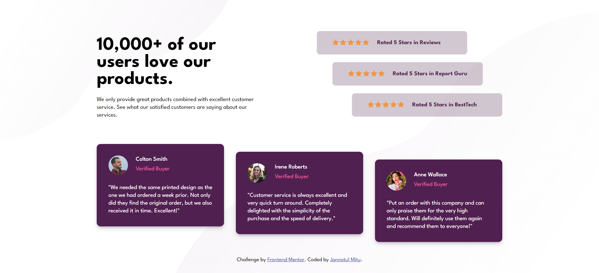
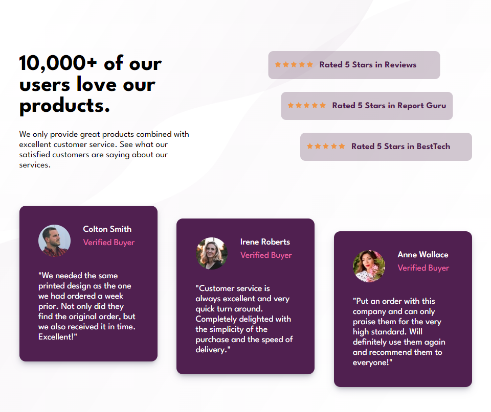
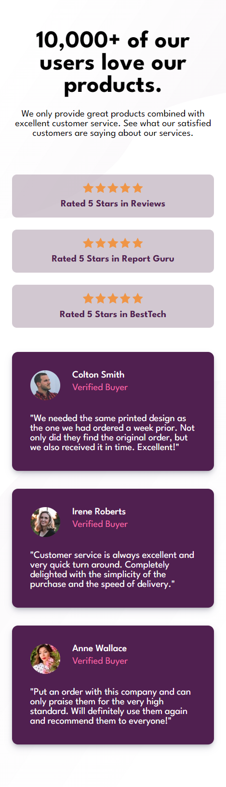

# Frontend Mentor - Social proof section solution

This is a solution to the [Social proof section challenge on Frontend Mentor](https://www.frontendmentor.io/challenges/social-proof-section-6e0qTv_bA). Frontend Mentor challenges help you improve your coding skills by building realistic projects. 

## Table of contents

- [Overview](#overview)
  - [The challenge](#the-challenge)
  - [Screenshot](#screenshot)
  - [Links](#links)
- [My process](#my-process)
  - [Built with](#built-with)
  - [What I learned](#what-i-learned)
- [Author](#author)

## Overview

### The challenge

Users should be able to:

- View the optimal layout for the section depending on their device's screen size

### Screenshot

#### Desktop


#### Tablet


#### Mobile



### Links

- Solution URL: [My solution URL](https://github.com/jannatulmitu03/social-proof-section)
- Live Site URL: [My live site URL](https://jannatulmitu03.github.io/social-proof-section)

## My process

### Built with

- Semantic HTML5 markup
- CSS custom properties
- Flexbox
- CSS Grid
- Pseudo-class selector
- Transform (translate)
- Desktop-first workflow


### What I learned

#### Pseudo-class selector
```css
.author p:last-child{
    color: var(--Soft-Pink);
}
```

#### Transform (translate)
```css
.icon-group:nth-child(1){
    transform: translateX(-90px);
}
.icon-group:nth-child(2){
    transform: translateX(-50px);
}
```
```css
.hero-content:nth-child(2){
    transform: translatey(20px);
}
.hero-content:nth-child(3){
    transform: translatey(40px);
}
```

## Author

- Website - [Jannatul Mitu](https://www.linkedin.com/in/jannatulmitu03)
- Frontend Mentor - [@jannatulmitu03](https://www.frontendmentor.io/profile/jannatulmitu03)
- Twitter - [@jannatulmitu03](https://twitter.com/jannatulmitu03)
